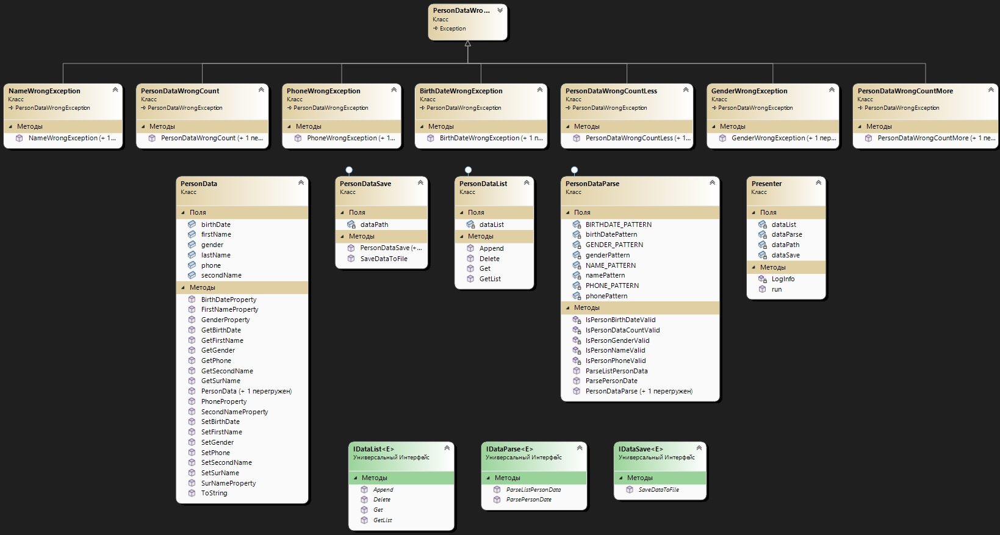

## Продвинутая работа с исключениями

## Задача
Напишите приложение, которое будет запрашивать у пользователя следующие данные в произвольном порядке, разделенные пробелом:
Фамилия Имя Отчество датарождения номертелефона пол

Форматы данных:
фамилия, имя, отчество - строки
датарождения - строка формата dd.mm.yyyy
номертелефона - целое беззнаковое число без форматирования
пол - символ латиницей f или m.

Приложение должно проверить введенные данные по количеству.
Если количество не совпадает с требуемым, вернуть код ошибки, обработать его и показать пользователю сообщение, что он ввел меньше и больше данных, чем требуется.

Приложение должно попытаться распарсить полученные значения и выделить из них требуемые параметры.
Если форматы данных не совпадают, нужно бросить исключение, соответствующее типу проблемы.
Можно использовать встроенные типы java и создать свои. Исключение должно быть корректно обработано, пользователю выведено сообщение с информацией, что именно неверно.

Если всё введено и обработано верно, должен создаться файл с названием, равным фамилии, в него в одну строку должны записаться полученные данные, вида

<Фамилия><Имя><Отчество><датарождения> <номертелефона><пол>

Однофамильцы должны записаться в один и тот же файл, в отдельные строки.

Не забудьте закрыть соединение с файлом.

При возникновении проблемы с чтением-записью в файл, исключение должно быть корректно обработано, пользователь должен увидеть стектрейс ошибки.

## Описание общего алгоритма работы программы.
Консольное приложение C# на net6.0.

При парсинге строки введенной пользователем проводится проверка на соответствие количества переданных параметров количеству требуемых данных.

После проверки соответствия, каждый параметр проверяется на соответствие какому-либо из форматов с помощью регулярных выражений.

Система имеет собственный полный набор регулярных выражений, при необходимости выражения можно задать при создании сервиса по обработке строк данных.

Если параметр подходит - заполняется соответствующий атрибут класса данных.
После проводится проверка заполненности данных класса.

В случае несоответствия количества параметров или отсутствия какого-либо параметра выбрасывается PersonDataWrongException.

Информация о возникшей исключительной ситуации отображается в консоли.

Распознанная информация сохраняется в текстовые файлы с программой.

## Диаграмма классов
